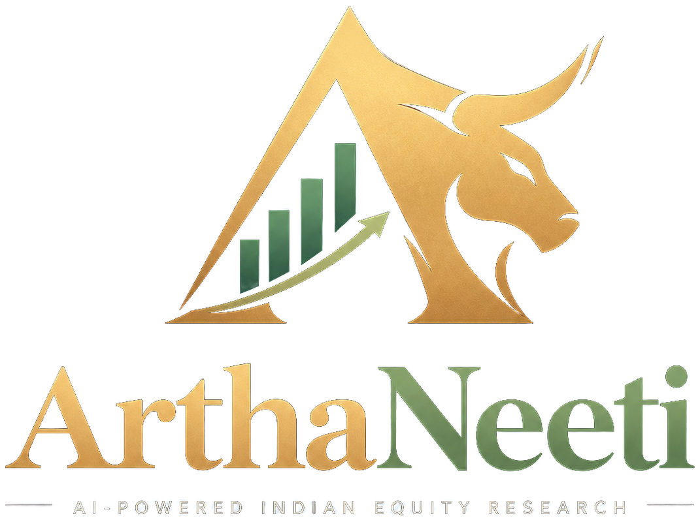
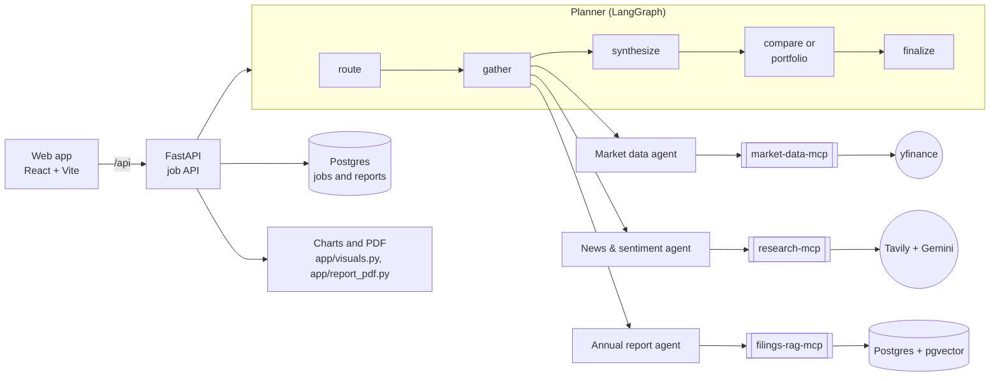

<p align="center">
  
</p>

<p align="center">
  Equity research on NSE-listed companies, assembled by a team of AI agents from
  live market data, recent news and the companies' own annual reports.
</p>

---

ArthaNeeti turns a plain-English question into a cited research report. Ask
*"Give me a complete research view on TCS"*, *"TCS or Infosys, which is the
better investment right now?"* or *"I hold equal amounts of TCS and Infosys, how
diversified is this?"* and a planner routes the question to specialist agents,
each grounded in real data sources, then merges their findings into a single
report with charts, sources for every claim, and the points where the sources
disagree.

The name is Sanskrit: *artha* (wealth) and *nīti* (policy, method).

## Features

- **Three report types.** Single-company research, side-by-side comparisons,
  and portfolio reviews with weighted valuation metrics and sector exposure.
- **Grounded specialists.** Market data from yfinance, news and sentiment from
  web search with LLM classification, and retrieval over the text of annual
  reports with page citations.
- **Selective routing.** Only the specialists a question needs are run, and
  every skipped source is listed with the reason.
- **Conflicts made visible.** When sources disagree (strong fundamentals,
  negative sentiment), the report says so and explains whether it is a real
  contradiction or a difference in time frame.
- **Charts and a PDF.** Share price, returns, revenue and profit, margins,
  sentiment and peer metrics, on the web dashboard and in a downloadable report.
- **Live progress.** The research plan appears within seconds, and each
  specialist's status updates as it works.
- **Follow-up questions.** Answered from the finished report in one call, or
  turned into a new research run when the report can't answer them.
- **Any annual report.** Upload a company's annual report, or let ArthaNeeti
  find it, to add annual-report analysis for that company.

## Architecture



- **API** (`app/`): research runs take minutes, so they are jobs. `POST
  /research` returns a job id immediately; clients poll for routing, progress
  and the report. Chart data is computed from market data without an LLM.
- **Planner** (`agents/planner.py`): a LangGraph graph that routes the
  question, runs specialists with bounded concurrency, synthesizes one report
  per company, then compares companies or analyses the portfolio.
- **Specialist agents** (`agents/`): ReAct agents on Groq, each connected to one
  MCP server over stdio, returning structured findings with provenance.
- **MCP servers** (`mcp_servers/`): eleven tools across three servers, usable by
  any MCP client.
- **Rate limiter** (`shared/`): one cross-process ledger that paces every LLM
  call against the shared free-tier quotas.

## Repository layout

| Path | Contents |
| --- | --- |
| [`agents/`](agents/README.md) | Planner, specialist agents, synthesis and follow-up agents |
| [`app/`](app/README.md) | FastAPI service, job runner, chart data and PDF export |
| [`mcp_servers/`](mcp_servers/README.md) | Market data, research and filings MCP servers |
| [`shared/`](shared/README.md) | Cross-process LLM rate limiter |
| [`frontend/`](frontend/README.md) | React web app |
| [`tests/`](tests/README.md) | Unit tests and opt-in live integration tests |
| [`docker/`](docker/README.md) | Container images and nginx configuration |
| [`scripts/`](scripts/README.md) | Brand asset generation and scheduled ingestion |
| [`assets/`](assets/README.md) | Logo source files and fonts |
| [`data/`](data/README.md) | Local annual-report PDFs (not committed) |

## Tech stack

| Area | Technology |
| --- | --- |
| Agents | LangGraph, LangChain, Model Context Protocol (stdio) |
| Models | Groq `openai/gpt-oss-120b` with fallbacks; Gemini for sentiment and embeddings |
| Data | yfinance, Tavily, PostgreSQL with pgvector (Supabase) |
| Backend | Python 3.11, FastAPI, Uvicorn, reportlab |
| Frontend | React 19, Vite, Tailwind CSS 4, Recharts |
| Delivery | Docker, nginx, Render, Vercel |

## Getting started

You need API keys for [Groq](https://console.groq.com),
[Google Gemini](https://aistudio.google.com) and [Tavily](https://tavily.com),
all of which have free tiers, and a PostgreSQL database with the `vector`
extension (a free [Supabase](https://supabase.com) project works).

```bash
git clone https://github.com/23f2001127/artha-neeti.git
cd artha-neeti
cp .env.example .env        # then fill in the four required values
```

### With Docker

```bash
docker compose up --build
```

The web app runs at <http://localhost:8080> and the API at
<http://localhost:8000> (interactive docs at `/docs`). See
[`docker/README.md`](docker/README.md) for running a local database as well.

### Without Docker

Backend (Python 3.11):

```bash
python -m venv venv
source venv/bin/activate            # Windows: venv\Scripts\activate
pip install -r requirements.txt
uvicorn app.main:app --reload
```

Frontend (Node 20 or later), in a second terminal:

```bash
cd frontend
npm install
npm run dev                         # http://localhost:5173
```

### Indexing annual reports

Annual-report analysis needs each company's report in the vector index. Add
reports from the web app (**Add a company** on the research page), through the
API, or in bulk from PDFs placed in `data/filings/`:

```bash
python -m mcp_servers.filings_rag_mcp.ingest            # index every PDF, resumable
python -m mcp_servers.filings_rag_mcp.ingest --status   # progress
```

The free Gemini tier embeds about 1,000 passages a day, so a large batch takes
several daily runs; [`scripts/daily_ingest.ps1`](scripts/README.md) automates
that on Windows.

## Using the API

```bash
curl -X POST localhost:8000/research -H "Content-Type: application/json" \
     -d '{"query": "Give me a complete research view on TCS"}'
# {"job_id": "...", "status": "queued"}

curl localhost:8000/research/<job_id>              # progress, then the report
curl -o report.pdf localhost:8000/research/<job_id>/report.pdf
```

The full endpoint reference is in [`app/README.md`](app/README.md).

## Testing

```bash
pip install -r requirements-dev.txt
pytest                      # offline unit tests
pytest --live               # also run integration tests against the real APIs
```

Live tests call the real providers and use free-tier quota; see
[`tests/README.md`](tests/README.md).

## Deployment

The backend deploys to Render as a Docker web service and the frontend to
Vercel as a static site, both on free plans, using the committed
`render.yaml` and `vercel.json`.

1. **Render:** create a Blueprint from this repository. In the service's
   environment settings, add `GROQ_API_KEY`, `GEMINI_API_KEY`,
   `TAVILY_API_KEY` and `DATABASE_URL`. Note the service URL once deployed.
2. **Vercel:** import the repository and set `VITE_API_BASE_DIRECT` to the
   Render URL. Note the site URL once deployed.
3. **Render:** set `CORS_ALLOWED_ORIGINS` to the Vercel URL.

`MAX_DAILY_JOBS` and `IP_THROTTLE_PER_MINUTE` (set in `render.yaml`) protect the
shared LLM quota on a public deployment. Render's free plan sleeps after 15
minutes without traffic and takes up to a minute to wake.

## Limitations

- On free API tiers a single-company report takes about 5 to 10 minutes and a
  comparison 20 to 30, because every LLM call is paced to stay within quota.
- Each company has one indexed annual report, so filings analysis covers a
  single year; multi-year trends come from market data.
- Sentiment scores are the classifier's own confidence, not calibrated
  probabilities, and cover a sample of recent coverage.
- Reports are for information only and are not investment advice.

## License

[MIT](LICENSE)

## Author

Designed and built by **Antareep Ghosh** ([GitHub](https://github.com/23f2001127)).
